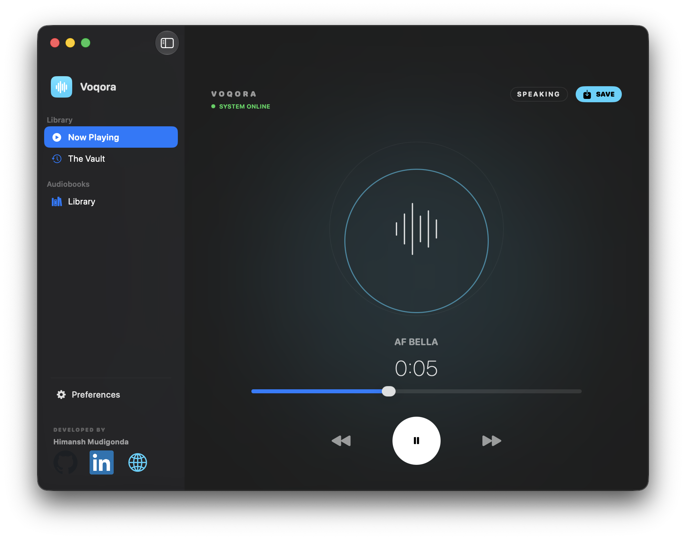
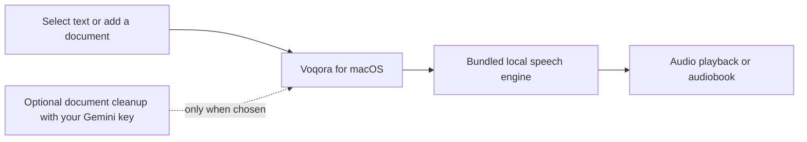

# Voqora

> **Listen to the text you are already reading.**

Voqora is a native Mac app for turning selected text into natural speech and
turning long documents into resumable audiobooks. It is built for the moment when
you still need to get through the material, but do not want to keep staring at
it.

Previously published as SuperSay. Its archival product history lives in the
[legacy post](https://himudigonda.me/blog/supersay); this repository documents
Voqora as it exists today.

<p align="center">
  <a href="https://github.com/himudigonda/Voqora/releases/latest"></a>
  
  
  <a href="LICENSE"></a>
</p>

<p align="center">
  
</p>

## Start here

<p>
  <a href="https://github.com/himudigonda/Voqora"><strong>Explore the project on GitHub</strong></a>
  &nbsp;·&nbsp;
  <a href="https://himudigonda.me/api/voqora/download?source=github_readme"><strong>Download Voqora for Mac</strong></a>
</p>

1. Download the [latest Voqora release](https://github.com/himudigonda/Voqora/releases/latest).
2. Drag Voqora to Applications.
3. Select text in a browser, PDF reader, IDE, Notes, or another app.
4. Press `Command + Shift + .`.

For a long document, open **Audiobooks**, add a PDF, TXT, DOCX, or Markdown
file, and come back to it when
you are walking, commuting, or simply done looking at a screen.

## What Voqora does

| When you need to… | Voqora gives you… |
| --- | --- |
| Listen to an article, document, or code review | A global shortcut that speaks selected text. |
| Control speech without changing apps | Global pause, stop, and export shortcuts. |
| Make long reading portable | A resumable document-to-audiobook workflow. |
| Tune the experience | Voice, speed, volume, local history, and WAV export. |
| Keep the core speech path on your Mac | A bundled local speech engine for Apple silicon. |

### Shortcuts

| Action | Default |
| --- | --- |
| Speak selection | `Command + Shift + .` |
| Play / pause | `Command + Shift + /` |
| Stop | `Command + Shift + ,` |
| Export the latest clip | `Command + Shift + M` |

All four are remappable in Preferences.

## How it works



The speech engine runs locally. Voqora does not require an account to speak
text. Optional document cleanup is separate: if you provide a Gemini API key and
choose that flow, the relevant document material is sent to Gemini for that
operation. See [PRIVACY.md](PRIVACY.md) for the complete product boundary.

## Product boundary, plainly stated

| What you do | What Voqora does | What it does not do by default |
| --- | --- | --- |
| Speak selected text | Sends it to the bundled local speech service on your Mac. | Upload it to a hosted text-to-speech API. |
| Add a PDF, TXT, DOCX, or Markdown file | Extracts, narrates, and stores audiobook progress locally. | Create an account or send the document to Voqora's servers. |
| Clean a difficult document | Uses Gemini only after you provide a key and explicitly choose that operation. | Send document material to Gemini in the background. |
| Use product analytics | Sends an optional anonymous event with a tightly limited set of product metrics. | Send selected text, file contents, audio, filenames, or API keys. |
| Check for an update | Checks Voqora's public update feed for a newer release. | Upload your reading activity or personal files. |

An optional email in Preferences helps attribute a returning installation, but
Voqora works fully without it. Installations, download clicks, product events,
and opted-in contacts are measured as different things, because a useful
product dashboard should describe reality rather than manufacture a flattering
audience number.

## Built as a native Mac utility

The visible action is one shortcut. The work behind it is a deliberately small
native system: SwiftUI and AppKit for the Mac experience, a bundled local
FastAPI service for speech, Kokoro ONNX for synthesis, and streaming audio
playback so listening can begin before a longer passage has fully rendered.

That split is intentional. A browser tab can make sound. A useful desktop
utility has to work with selected text in other applications, survive restarts,
remember progress, recover from permissions and engine startup, and stay out
of the way once it is set up. The [architecture guide](docs/architecture.md)
maps those boundaries; the [technical deep dive](https://himudigonda.me/blog/voqora)
explains the decisions behind them.

## Measured on the launch machine

On an Apple M2 Pro with 16 GB memory, a fresh local benchmark run on 2026-07-30
measured **458 ms** to first audio for a mixed passage and **2.7x real-time**
generation. Medium-passage scenarios measured **2.8–2.9x real time**. These
are engine measurements after normal warm-up, not a universal
keyboard-to-speaker latency promise. The exact scenario matrix is regenerated
with `make benchmark` before a release or public performance claim.

## Install notes

Voqora is free to download, but the current release is not yet Apple-notarized. After
dragging it to Applications, try opening it normally. If macOS blocks that
first launch, open **System Settings -> Privacy & Security**, choose **Open
Anyway** for Voqora, then open it again.

If that button is missing or macOS keeps showing the same warning, and you
downloaded the DMG from [the official release page](https://github.com/himudigonda/Voqora/releases/latest), run this once in Terminal:

```bash
xattr -dr com.apple.quarantine /Applications/Voqora.app
open /Applications/Voqora.app
```

That command removes macOS's downloaded-file quarantine marker from that one
installed copy of Voqora. Do not use it on software you do not trust.

## Build from source

Requirements: macOS 14+, Xcode, Python 3.11+, and
[uv](https://docs.astral.sh/uv/).

```bash
make setup
make run
```

The first backend build downloads the pinned Kokoro model and voice assets,
then verifies their checksums. The model assets are intentionally not committed
to the repository.

### Validation without waking up a fleet of app hosts

```bash
make verify       # lint + fast backend tests; does not launch a macOS test host
make test-swift   # explicit, single serial macOS test host
make test-ci      # backend + the explicit serial macOS test target
```

## Documentation

- [User guide](docs/USER_GUIDE.md)
- [Architecture](docs/architecture.md)
- [Testing](docs/testing.md)
- [Contributing](docs/CONTRIBUTING.md)
- [Release process](docs/release.md)
- [Roadmap](docs/ROADMAP.md)
- [Data handling](PRIVACY.md)
- [Commercial licensing](COMMERCIAL-LICENSE.md)

## Release integrity

The repository keeps the source, install guidance, changelog, release process,
and signed update-feed tooling together. A candidate is not called ready just
because it compiles: it must pass the fast backend suite, the explicit serial
macOS suite, a mounted-DMG inspection, first-use validation, and an actual
update-feed check against the exact archive being shipped. See the
[release process](docs/release.md) for the full evidence checklist.

## License

Voqora is source-available under [PolyForm Noncommercial 1.0.0](LICENSE).
You may use, study, modify, and share it for non-commercial purposes.
Commercial use requires a separate agreement; see
[COMMERCIAL-LICENSE.md](COMMERCIAL-LICENSE.md).

Copyright 2026 Himansh Mudigonda.
