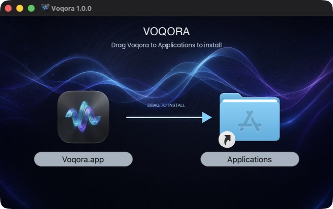
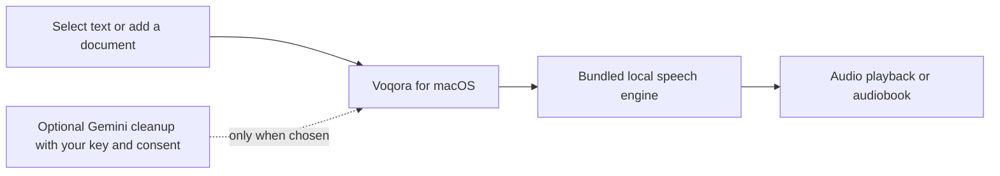

# Voqora

> **Listen to the text you are already reading.**

Voqora is a native Mac app for turning selected text into natural speech and
turning long documents into resumable audiobooks. It is built for the moment when
you still need to get through the material, but do not want to keep staring at
it.

> The latest public release is v1.0.0. This local-only branch contains the
> unreleased v1.1 product work and must not be published before its release gate.

<p align="center">
  <a href="https://github.com/himudigonda/Voqora/releases/tag/v1.0.0"></a>
  
  
  <a href="LICENSE"></a>
</p>

<p align="center">
  
</p>

## Start here

1. Download [Voqora v1.0.0](https://github.com/himudigonda/Voqora/releases/tag/v1.0.0).
2. Drag Voqora to Applications.
3. Select text in a browser, PDF reader, IDE, Notes, or another app.
4. Press `Command + Shift + .`.

For a long document, open **Audiobooks**, add a PDF, DOCX, Markdown, or text
file, and come back to it when
you are walking, commuting, or simply done looking at a screen.

## What Voqora does

| When you need to… | Voqora gives you… |
| --- | --- |
| Listen to an article, document, or code review | A global shortcut that speaks selected text. |
| Control speech without changing apps | Global pause, stop, and export shortcuts. |
| Make long reading portable | A resumable PDF, DOCX, Markdown, or text-file audiobook workflow. |
| Listen across languages | 28 curated voices in eight supported locales, with local auto-detection. |
| Tune the experience | Voice previews, speed, volume, local history, and WAV export. |
| Keep the core speech path on your Mac | A bundled local speech engine for Apple silicon. |

### Shortcuts

| Action | Default |
| --- | --- |
| Speak selection | `Command + Shift + .` |
| Play / pause | `Command + Shift + /` |
| Stop | `Command + Shift + ,` |
| Export the latest clip | `Command + Shift + M` |

All four are remappable in Preferences.

## How it works



The speech engine runs locally. Voqora does not require an account to speak
text. v1.1 adds on-device language recognition: English (US and UK), Spanish,
French, Italian, Brazilian Portuguese, Hindi, and Mandarin beta map to a
matching voice when auto-detection is enabled. Japanese is deliberately not
listed because its real-text phonemization is not yet reliable.

Optional document cleanup is separate: if you provide a Gemini API key, confirm
the consent control, and choose that flow, the relevant document material is
sent to Gemini for that operation. See [PRIVACY.md](PRIVACY.md) for the complete
product boundary.

## Measured on the launch machine

On an Apple M2 Pro with 16 GB memory, a warmed short selection reached first
audio in **0.39 seconds**. Warmed medium text rendered at **3.9x real time**.
Those are local measurements from the launch machine, not a universal
keyboard-to-speaker latency promise.

## Install notes

Voqora v1.0.0 is ad-hoc signed and not Apple-notarized. macOS can ask you to
approve the first launch in System Settings. This is the remaining distribution
step before a fully frictionless consumer install.

## Build from source

Requirements: macOS 14+, Xcode, Python 3.11+, and
[uv](https://docs.astral.sh/uv/).

```bash
make setup
make run
```

The first backend build downloads the pinned Kokoro model and voice assets,
then verifies their checksums. The model assets are intentionally not committed
to the repository.

### Validation without waking up a fleet of app hosts

```bash
make verify       # lint + fast backend tests; does not launch a macOS test host
make test-swift   # explicit, single serial macOS test host
make test-ci      # backend + the explicit serial macOS test target
```

## Documentation

- [User guide](docs/USER_GUIDE.md)
- [Architecture](docs/architecture.md)
- [Testing](docs/testing.md)
- [Contributing](docs/CONTRIBUTING.md)
- [Release process](docs/release.md)
- [Roadmap](docs/ROADMAP.md)
- [Data handling](PRIVACY.md)
- [Commercial licensing](COMMERCIAL-LICENSE.md)

## License

Voqora is source-available under [PolyForm Noncommercial 1.0.0](LICENSE).
You may use, study, modify, and share it for non-commercial purposes.
Commercial use requires a separate agreement; see
[COMMERCIAL-LICENSE.md](COMMERCIAL-LICENSE.md).

Copyright 2026 Himansh Mudigonda.
