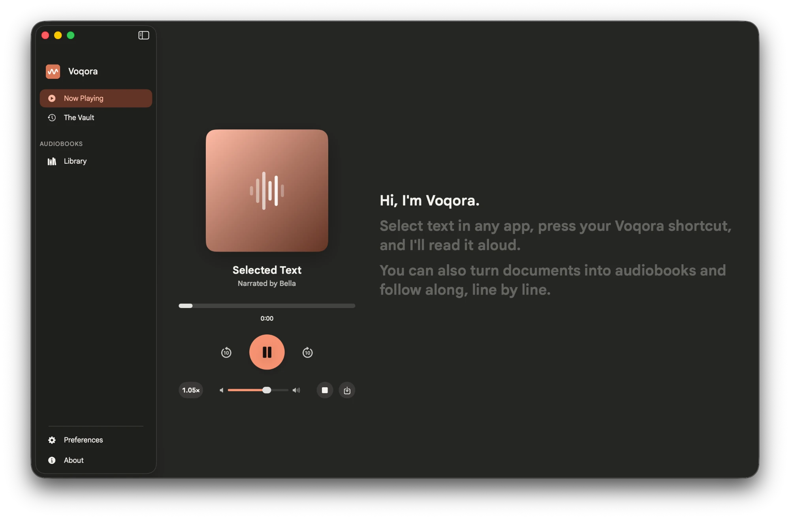
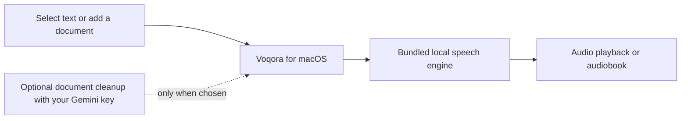

# Voqora

> **Listen to the text you are already reading.**

Voqora is a native Mac app for turning selected text into natural speech and
turning long documents into resumable audiobooks. It is built for the moment when
you still need to get through the material, but do not want to keep staring at
it.

- **Private, on-device speech.** Your text is turned into speech on your Mac,
  never on a server, and it works offline.
- **Unlimited.** No character quotas, no credits, no subscription.
- **Smarter audiobooks with Gemini.** Bring your own Gemini API key to clean up
  messy PDFs and scans before narration.
- **Free.**

Previously published as SuperSay. Its archival product history lives in the
[legacy post](https://himudigonda.me/blog/supersay); this repository documents
Voqora as it exists today.

<p align="center">
  <a href="https://github.com/himudigonda/Voqora/releases/latest"></a>
  
  
  <a href="LICENSE"></a>
</p>

<p align="center">
  <picture>
    <source media="(prefers-color-scheme: dark)" srcset="assets/voqora-dark.png">
    <source media="(prefers-color-scheme: light)" srcset="assets/voqora-light.png">
    
  </picture>
</p>

> **Early access.** Voqora is in early release and changing quickly. Feedback,
> [issues](https://github.com/himudigonda/Voqora/issues), and pull requests are
> all welcome; see [Contributing](docs/CONTRIBUTING.md).

## Start here

<p>
  <a href="https://github.com/himudigonda/Voqora"><strong>Explore the project on GitHub</strong></a>
  &nbsp;·&nbsp;
  <a href="https://himudigonda.me/api/voqora/download?source=github_readme"><strong>Download Voqora for Mac</strong></a>
</p>

1. Download the [latest Voqora release](https://github.com/himudigonda/Voqora/releases/latest).
2. Drag Voqora to Applications.
3. Select text in a browser, PDF reader, IDE, Notes, or another app.
4. Press `Command + Shift + .`.

For a long document, open **Library**, add a PDF, TXT, DOCX, or Markdown file,
and come back to it when you are walking, commuting, or simply done looking at
a screen.

## What Voqora does

| When you need to… | Voqora gives you… |
| --- | --- |
| Listen to an article, document, or code review | A global shortcut that speaks selected text. |
| Control speech without changing apps | Global pause, stop, and export shortcuts. |
| Make long reading portable | A resumable document-to-audiobook workflow. |
| Follow along | A transcript that highlights the sentence being read. Click any sentence to jump there. |
| Find your place in a long book | Sections, scrub previews with the chapter name, and a sleep timer that stops at the end of a section. |
| Tune the experience | Voice, speed, volume, The Vault (local history), and WAV export. |
| Listen as much as you want | An on-device speech engine for Apple silicon, with no usage limits. |

### Shortcuts

| Action | Default |
| --- | --- |
| Speak selection | `Command + Shift + .` |
| Play / pause | `Command + Shift + /` |
| Stop | `Command + Shift + ,` |
| Export the latest clip | `Command + Shift + M` |

All four are remappable in Preferences.

## How it works


```mermaid
flowchart LR
    A["Select text or add a document"] --> B["Voqora for macOS"]
    B --> C["Bundled local speech engine"]
    C --> D["Audio playback or audiobook"]
    E["Optional document cleanup with your Gemini key"] -. only when chosen .-> B
```

Speech runs entirely on your Mac, so it is private, unlimited, and works
offline. Audiobooks work out of the box; add your own Gemini API key for
cleaner text from messy PDFs and scanned pages.

## Built as a native Mac utility

The visible action is one shortcut. The work behind it is a deliberately small
native system: SwiftUI and AppKit for the Mac experience, a bundled local
FastAPI service for speech, Kokoro ONNX for synthesis, and streaming audio
playback so listening can begin before a longer passage has fully rendered.

That split is intentional. A browser tab can make sound. A useful desktop
utility has to work with selected text in other applications, survive restarts,
remember progress, recover from permissions and engine startup, and stay out
of the way once it is set up. The [architecture guide](docs/architecture.md)
maps those boundaries; the [technical deep dive](https://himudigonda.me/blog/voqora)
explains the decisions behind them.

## Measured on the launch machine

On an Apple M2 Pro with 16 GB memory, a local benchmark run on 2026-07-30
measured **458 ms** to first audio for a mixed passage and **2.7x real-time**
generation. Medium-passage scenarios measured **2.8–2.9x real time**. These
are engine measurements after normal warm-up, not a universal
keyboard-to-speaker latency promise. The exact scenario matrix is regenerated
with `make benchmark` before a release or public performance claim.

## Install notes

Voqora is free to download, but the current release is not yet Apple-notarized.
The release notes include the short path: drag Voqora to
Applications, eject the DMG, then open Voqora from Applications. If macOS blocks
that first launch, open **System Settings -> Privacy & Security**, choose **Open
Anyway** for Voqora, then open it again.

If that button is missing or macOS keeps showing the same warning, and you
downloaded the DMG from [the official release page](https://github.com/himudigonda/Voqora/releases/latest), run the
scoped recovery command after moving the app to Applications. You can
also run this once in Terminal:

```bash
xattr -dr com.apple.quarantine /Applications/Voqora.app
open /Applications/Voqora.app
```

That command removes macOS's downloaded-file quarantine marker from that one
installed copy of Voqora. Do not use it on software you do not trust.

## Build from source

Requirements: macOS 14+, Xcode 26, SwiftLint, SwiftFormat, Python 3.11+, and
[uv](https://docs.astral.sh/uv/).

```bash
make setup
make run
```

The first backend build downloads the pinned Kokoro model and voice assets,
then verifies their checksums. The model assets are intentionally not committed
to the repository.

### Validation without waking up a fleet of app hosts

```bash
make verify       # lint + fast backend tests; does not launch a macOS test host
make test-swift   # explicit, single serial macOS test host
make test-ci      # backend + release-script guards + the serial macOS test target
```

## Documentation

- [User guide](docs/USER_GUIDE.md)
- [Architecture](docs/architecture.md)
- [Testing](docs/testing.md)
- [Contributing](docs/CONTRIBUTING.md)
- [Release process](docs/release.md)
- [Roadmap](docs/ROADMAP.md)
- [Privacy policy](PRIVACY.md)
- [Commercial licensing](COMMERCIAL-LICENSE.md)

## Release integrity

The repository keeps the source, install guidance, changelog, release process,
and signed update-feed tooling together. A candidate is not called ready just
because it compiles: it must pass the fast backend suite, the explicit serial
macOS suite, a mounted-DMG inspection, first-use validation, and an actual
update-feed check against the exact archive being shipped. See the
[release process](docs/release.md) for the full evidence checklist.

## License

Voqora is source-available under [PolyForm Noncommercial 1.0.0](LICENSE).
You may use, study, modify, and share it for non-commercial purposes.
Commercial use requires a separate agreement; see
[COMMERCIAL-LICENSE.md](COMMERCIAL-LICENSE.md).

Copyright 2026 Himansh Mudigonda.
