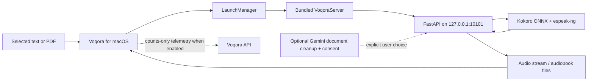

# Voqora architecture

Voqora combines a native SwiftUI Mac app with a bundled local Python speech
service. The split lets the product feel native on macOS while keeping the
speech pipeline close to the ONNX runtime it needs.

## System map

## Native app

The SwiftUI application owns the interface, global shortcuts, playback,
preferences, history, and audiobook views. It talks to the local service
through `http://127.0.0.1:10101`; the speech request never needs an external
speech endpoint.

On launch, `LaunchManager` extracts the bundled server archive into the
application-support directory for the current bundle identifier.
`BackendService` starts the executable, waits for its health endpoint, and
streams audio back to the app for playback.

## Speech path

1. The app receives selected or pasted text.
2. It posts a local request to the bundled FastAPI service.
3. The service segments the text and runs Kokoro ONNX inference.
4. Generated audio is returned progressively.
5. The native audio service schedules the received buffers for playback.

Inference is intentionally serialized around the phonemizer/runtime boundary.
The useful overlap is between playback of one completed segment and generation
of the next, rather than running unsafe concurrent inference.

The v1.1 candidate adds a backend-owned language/voice catalog. The native app
groups its 28 curated voices by locale and can use Apple's on-device
`NLLanguageRecognizer` to select a matching voice before it makes the local
speech request. The client still sends a voice identifier, and the backend maps
that identifier to the appropriate eSpeak language configuration.

## Audiobook path

The audiobook service extracts PDF, DOCX, Markdown, and text documents,
processes pages, creates audio, and persists local metadata needed for progress
and resume. It prefers structure present in the source file (PDF bookmarks,
DOCX heading styles, Markdown headings), then falls back only when needed.
Local extraction is the default. Optional Gemini cleanup and OCR require a
user-supplied key and explicit consent. Per-segment timing is persisted with
audio so the transcript can follow generated speech accurately.

## Data boundary

| Surface | Default behavior |
| --- | --- |
| Speech synthesis | Local bundled service. |
| Selected text | Sent to the local service for speech. |
| Audiobook state | Stored locally for resume and playback. |
| Document cleanup / OCR | Optional Gemini request only when the user provides a key, confirms consent, and chooses it. |
| Product telemetry | Optional counts-only events when enabled in Preferences. |
| Release check | GitHub request only when initiated. |

Read [PRIVACY.md](../PRIVACY.md) before changing one of these boundaries.

## Key directories

| Path | Responsibility |
| --- | --- |
| `frontend/Voqora/Voqora/` | SwiftUI app, native services, views, and assets. |
| `backend/app/` | FastAPI routes, local engine, audiobook service, and storage. |
| `backend/tests/` | Fast backend tests. |
| `frontend/Voqora/VoqoraTests/` | Swift unit and service tests. |
| `scripts/` | Backend packaging, DMG creation, release shipping, and benchmarks. |
