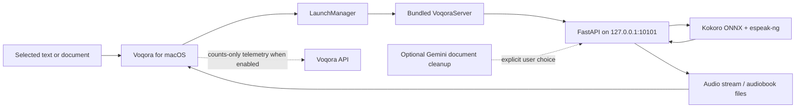

# Voqora architecture

Voqora combines a native SwiftUI Mac app with a bundled local Python speech
service. The split lets the product feel native on macOS while keeping the
speech pipeline close to the ONNX runtime it needs.

## System map

## Native app

The SwiftUI application owns the interface, global shortcuts, playback,
preferences, history, and audiobook views. It talks to the local service
through `http://127.0.0.1:10101`; the speech request never needs an external
speech endpoint.

On launch, `LaunchManager` extracts the bundled server archive into the
application-support directory for the current bundle identifier.
`BackendService` starts the executable, waits for its health endpoint, and
streams audio back to the app for playback.

## Speech path

1. The app receives selected or pasted text.
2. It posts a local request to the bundled FastAPI service.
3. The service segments the text and runs Kokoro ONNX inference.
4. Generated audio is returned progressively.
5. The native audio service schedules the received buffers for playback.

Inference is intentionally serialized around the phonemizer/runtime boundary.
The useful overlap is between playback of one completed segment and generation
of the next, rather than running unsafe concurrent inference.

## Audiobook path

The audiobook service extracts a document, processes pages, creates audio, and
persists local metadata needed for progress and resume. Local extraction is the
default. Optional Gemini cleanup and OCR are invoked only with a user-supplied
key and an explicit selection of that workflow.

## Data boundary

| Surface | Default behavior |
| --- | --- |
| Speech synthesis | Local bundled service. |
| Selected text | Sent to the local service for speech. |
| Audiobook state | Stored locally for resume and playback. |
| Document cleanup / PDF OCR | Optional Gemini request when the user provides a key and chooses it. |
| Product telemetry | Optional counts-only events when enabled in Preferences. |
| Release check | GitHub request only when initiated. |

Read [PRIVACY.md](../PRIVACY.md) before changing one of these boundaries.

## Key directories

| Path | Responsibility |
| --- | --- |
| `frontend/Voqora/Voqora/` | SwiftUI app, native services, views, and assets. |
| `backend/app/` | FastAPI routes, local engine, audiobook service, and storage. |
| `backend/tests/` | Fast backend tests. |
| `frontend/Voqora/VoqoraTests/` | Swift unit and service tests. |
| `scripts/` | Backend packaging, DMG creation, release shipping, and benchmarks. |
